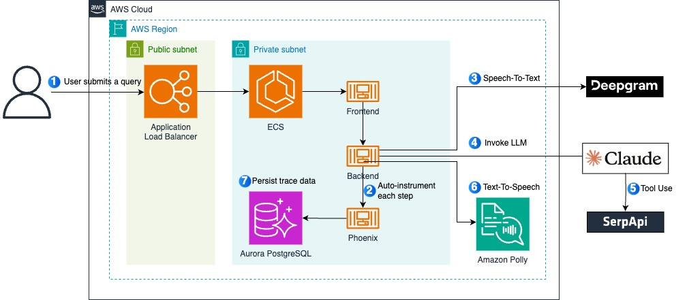

# Building OpenAI Advanced Voice Mode Clone with LangGraph, Deepgram, Claude and Amazon Polly



This repository contains a step-by-step guide for building an OpenAI Advanced Voice Mode Clone with LangGraph, Deepgram, Claude and Amazon Polly. The concepts in this respository are applicable to any situation where you want to add voice capability. However, note that the configuration we used for resources in this post, such as Amazon Elastic Load Balancer (Amazon ELB), Amazon Elastic Container Registry (Amazon ECR), etc., are not suitable for production use as-is. You would need a thorough security review if you plan to take the concepts to your production environment.

## Getting Started
Clone the git repository into a folder. For example:

```
git clone https://github.com/seanlee10/voice-agent-with-deepgram.git
```

### Step 1. Build Images

```
cd /frontend
docker build -t frontend .
```

```
cd /backend
docker build -t backend .
```

### Step 2. Provision Resources

```
cd /infra
cdk deploy
```

### Step 3. Verify 


### Step 4. Clean Up

```
cdk destroy
```

## License

This library is licensed under the MIT-0 License. See the LICENSE file.
